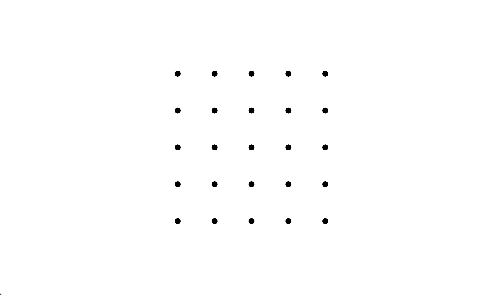
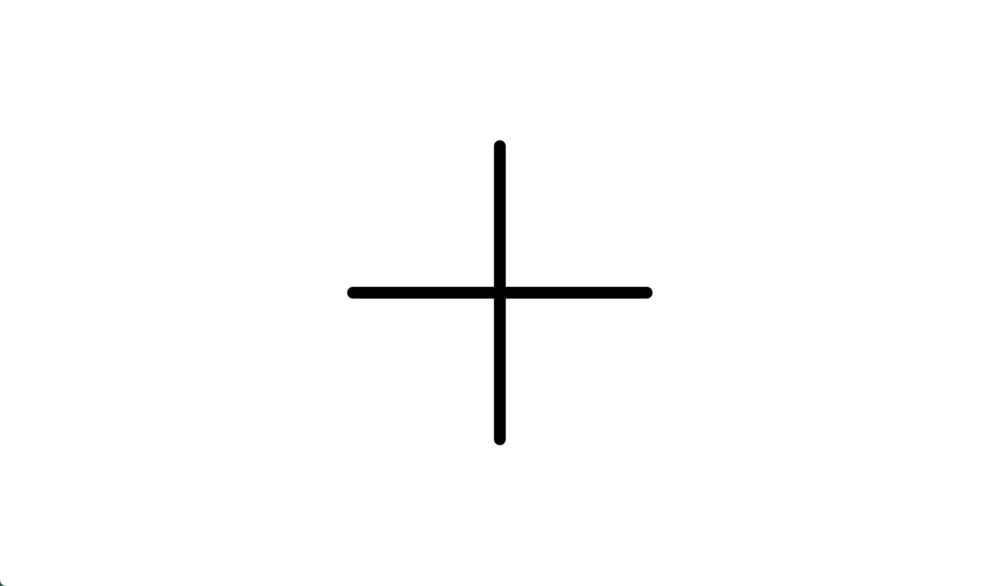

# TRANSITIONS 2023

## Folder structure
- sketches: All sketches are here.
- libraries: Libraries like p5, p5.sound.
- shared: Shared scripts used in multiple sketches.

## Development
To start working, run a dev server (e.g. [VS Code Live Server](https://marketplace.visualstudio.com/items?itemName=ritwickdey.LiveServer)) from the root repository folder (where this README.md is), and open the url shown.

### Run a single sketch
Run a sketch by opening the corresponding folder, as it is relative to the root repository folder. E.g. to run the [shapes sketch](sketches/shapes/) sketch, go to http://localhost:5500/sketches/shapes.

### Create a new sketch
Duplicate an existing sketch in [sketches](sketches).

### Run a sequence of sketches
To run multiple sketches in a sequence, add or change the paths in [main.js](main.js) and open the root of the website (e.g. http://localhost:5500)

Check the [empty sequence sketch example](sketches/example-sequence-empty/) for how to change between the sketches.

## Shapes
Here are the shapes we'll use. Check about the details in the [shapes sketch](sketches/shapes/sketch.js)

